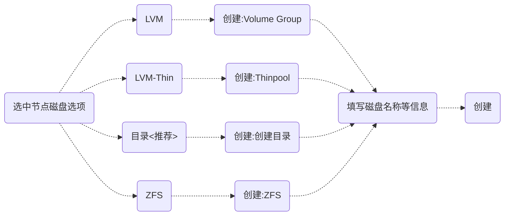
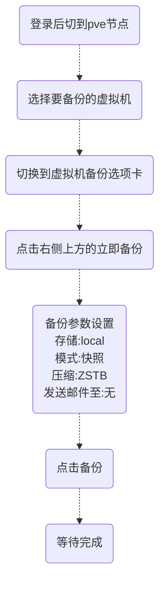
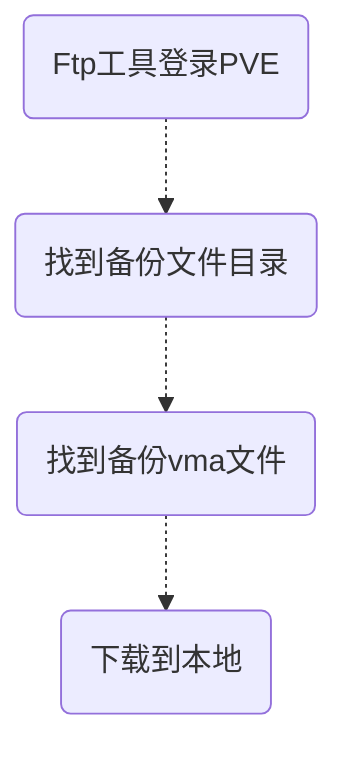
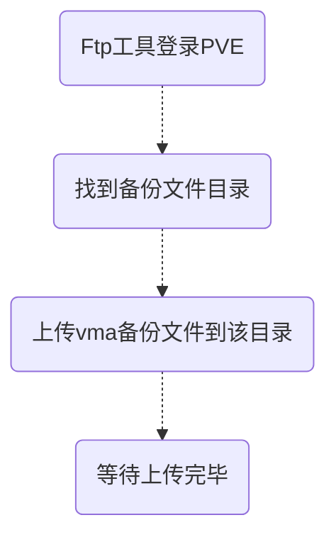
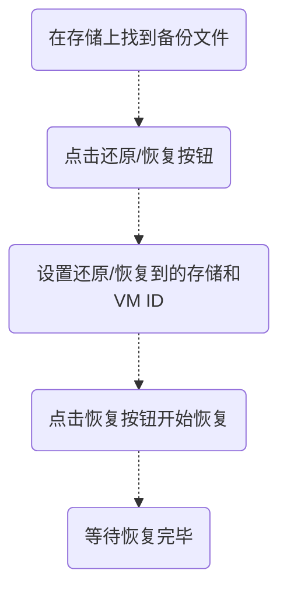

[在线详细文档](https://pve.proxmox.com/pve-docs/pve-admin-guide.html)

[TOC]

PVE实操过程实录

# 前言
|||
|-|-|
|基本OS|Debian GNU / Linux|
|宿主机最大RAM和CPU|12TB CPU为768逻辑CPU|
|单个集群最大服务器|32个节点，建议每10台建立一个集群|


# 第一节：PVE安装
物理机安装pve
pve  install  in hardware pc  

1、下载镜像文件 / download image  
* url：<https://www.proxmox.com/en/downloads>   
* version：[proxmox-ve_7.1-2.iso](https://www.proxmox.com/en/downloads?task=callelement&format=raw&item_id=638&element=f85c494b-2b32-4109-b8c1-083cca2b7db6&method=download&args[0]=894a15e72ec01863cc18396f276617b8) 

2、写盘 / write diver image with ultralISO  
~~~javascript
// 步骤 step:
-> open ultraliso 
// 写入方式 : RAW
-> start 
-> write diver image
~~~

3、连接USB镜像与设置bios / insert usb   &   bios set  
```shell
enable vt or vt-d  
select boot
```

4、启动电脑 / start pc  

5、选择安装install proxmox ve / select first option " install proxmox ve "  

6、一直下一步 / next-> -> -> ->   

7、目标选硬盘 / target harddisk  

8、国家选中国 / country->china  
```shell
time zone -> shanghai
keyboard layout -> u.s.
```

9、设置密码与邮箱 / set password  and e-mail(can custom)  

10、设置主机名与网络ip / set hostname  (eg.pve1.xxx.com) and set network and ip -> next  

11、一直下一步 / next-> -> -> -> wait....  

12、打开web控制台 / open web console  
```shell
# 查看web地址
cat /etc/issue

# result
------------------------------------------------------------------------------

Welcome to the Proxmox Virtual Environment. Please use your web browser to 
configure this server - connect to:

  https://192.168.1.8:8006/

------------------------------------------------------------------------------
```

|url段|值|
|----|----|
|schemas|https|
|port|8006|  

# 第二节：PVE时区与时间管理
## 一、设置时区  
一般安装时已经选择，无需再设置  

1、 查看当前系统时间  
```shell
date -R
```

2、 如果不是东八区，那么就接着要调整时区  
```shell
tzselect
```

3、 过程略
```shell
# 选择  Asia=>中国（China)=>北京(Beijing)
```

4、 拷贝配置生效  
```shell
sudo cp /usr/share/zoneinfo/Asia/Shanghai  /etc/localtime
```  

5、检查生效情况  
```shell
date -R
```
## 二、手动校时 
  
```shell
# 修改日期
sudo date -s MM/DD/YY 
# 修改时间   
sudo date -s hh:mm:ss  
# 非常重要，如果没有这一步的话，后面时间还是不准  
sudo hwclock --systohc 
```
## 三、网络校时 

```shell
apt install ntpdate -y

ntpdate 210.72.145.44    # 中国国家时间服务器: 210.72.145.44
# ntp.ntsc.ac.cn
```

## 四、Debian自动网络校时  

1、使用Linux crontab 用来定期执行更新时间
|参数|作用|
|----|----|
|-u|用户<font color=gray size=2>（eg. root &nbsp; /&nbsp; user）</font>|
|-r|删除时程表|
|-l|列出时程表|
|-e|执行文本任务<font color=gray size=2>（eg. -e ntpdate ntp.ntsc.ac.cn）</font>|

2、Crontab表达式补充
    2.1 Cron-Expressions的各个子表达式含义
~~~
*    *    *    *    *
-    -    -    -    -
|    |    |    |    |
|    |    |    |    +----- 星期中星期几 (0 - 6) (星期天 为0)
|    |    |    +---------- 月份 (1 - 12) 
|    |    +--------------- 一个月中的第几天 (1 - 31)
|    +-------------------- 小时 (0 - 23)
+------------------------- 分钟 (0 - 59)
~~~   

2.2 Crontab特殊字符含义
|符号|含义|
|:-:|-|
|/|每又，<font color=gray size=2>(eg. 2/5 * * * *) 表示：每5分钟又2分，等于0+2，5+2...</font>|
|-|在\*与\*之间每，<font color=gray size=2>（eg. 2-5 * * * *）表示：在2与5之间每分钟</font>|
|,|\*和\*的时候<font color=gray size=2>（eg. 2,5 * * * *）表示：在2和5的时候</font>|

2.3 举一些完整的Crontab表达式例子：
<em>注意看大单位定位小单位读法</em>
表达式|含义
|-|-|
|* * * * * |	每天每小时每隔 1 分钟执行一次计划任务|
|0 * * * *	|	每天每小时整点执行一次计划任务|
|15 10 * * *	|	每天 10:15 执行一次计划任务|
|5 12 1 * *	|	每个月 1 号的 12:05 执行一次计划任务|
|10 15 20 3 *	|	每年 3 月 20 日 15:10 执行一次计划任务|
|10 15 * 3 0	|	每年 3 月的每个周日 15:10 执行一次计划任务|
|* 14 * * *	|	每天从 14:00 到 14:59 每隔 1 分钟执行一次触发|
|0/5 14 * * *	|	每天从 14:00 到 14:59 每个 5 分钟执行一次触发|
|0/5 14,18 * * *	|	每天从 14:00 到 14:59 和 18:00 到 18:59 每隔 5 分钟执行一次触发|
|0-5 14 * * *	|	每天从 14:00 到 14:05 每隔 1 分钟执行一次触发|
|10,44 14 * 3 WED	|	3 月的每个星期 3 的 14:10 和 14:44 分别执行一次触发|
|0 0 1 * *	|	每月的第一天执行一次触发|

2.4 添加定时网络校时任务
```shell
# 编辑时程表
crontab -e

# 追加以下内容，每周0点0分0时
0 0 * * 1 ntpdate ntp.ntsc.ac.cn
```

## 五、Proxmox使用Chrony用作默认的NTP守护程序

1、安装chrony一般已经安装  

```shell
apt install chrony
```

2、配置chrony.conf

```shell
nano /etc/chrony/chrony.conf

#添加
#中国国家授时中心
pool ntp.ntsc.ac.cn iburst
pool ntp1.aliyun.com iburst
```
使用nano编辑完之后，使用组合键 <kbd>Ctl</kbd>+<kbd>O</kbd> 保存,使用组合键 <kbd>Ctl</kbd>+<kbd>X</kbd> 退出

3、重启chrony
```shell
systemctl restart chronyd
```

4、chronyd正在访问的当前时间源的信息
```shell
chronyc sources
```

5、查看chrony状态，如果查到无需安装
```shell
systemctl status chronyd
```

6、验证自动同步
通过减少一天时间，等待5分钟查看是否自动同步
```shell
date -s "-1 day"
```


# 第三节：设置PVE的软件源

## 一、查看Debian版本
设置debian软件源时需要，下面以 ***(debian11(bullseye))***  为例设置  
```shell
# 第一种
cat /etc/debian_version

# 第二种
uname -a

# 第三种
hostnamectl

--------------------------------------------------------------------------
#返回
   Static hostname: pve1
         Icon name: computer-desktop
           Chassis: desktop
        Machine ID: ec6d71b0fd6d435aab17f4fce710ed2f
           Boot ID: f6d78431aa27454baaffc981e2c2eac1
   Operating System: Debian GNU/Linux 11 (bullseye)
            Kernel: Linux 5.13.19-2-pve
--------------------------------------------------------------------------

# 第四种
cat /etc/os-release
```

## 二、软件源配置文件
有2种软件仓库构成  
1. Debian的软件源  
2. Proxmox VE专用软件源  
  - 企业源
  - 无订阅源
  - 测试源

PVE软件源的配置文件:  
```shell
# Debian系统源和proxmox源
/etc/apt/sources.list

# Proxmox企业仓库更新源
/etc/apt/sources.list.d/pve-enterprise.list 

# 创建五订阅更新源
touch /etc/apt/sources.list.d/pve-no-subscription.list
```

## 三、常用国内镜像源
```shell
# 清华开源镜像站
https://mirrors.tuna.tsinghua.edu.cn/
# 使用帮助 https://mirrors.tuna.tsinghua.edu.cn/help/proxmox/
# wget https://mirrors.ustc.edu.cn/proxmox/debian/proxmox-release-bullseye.gpg -O /etc/apt/trusted.gpg.d/proxmox-release-bullseye.gpg

# 中科大学开源软件镜像
https://mirrors.ustc.edu.cn/

## 阿里云（没找到pve的源）
http://mirrors.aliyun.com/debian/
# 使用帮助 https://developer.aliyun.com/mirror/debian
```

## 四、设置PVE更新源    
1、注释掉Proxmox企业版更新源source list  
```shell
# 方法一：注释掉（推荐）
vi /etc/apt/sources.list.d/pve-enterprise.list
# nano /etc/apt/sources.list.d/pve-enterprise.list

# 然后用 '#' 注释掉其中的地址
# deb https://enterprise.proxmox.com/debian/pve buster pve-enterprise

# 方法二：删除
rm -rf /etc/apt/sources.list.d/pve-enterprise.list

# 方法二：更改为备份
mv /etc/apt/sources.list.d/pve-enterprise.list /etc/apt/sources.list.d/pve-enterprise.list.bak

```

2、设置Debian系统源（阿里云源）和proxmox源  
```shell
nano /etc/apt/sources.list
# vi /etc/apt/sources.list
```
修改为：
```shell

# deb http://ftp.debian.org/debian bullseye main contrib
# deb http://ftp.debian.org/debian bullseye-updates main contrib

# security updates
# deb http://security.debian.org bullseye-security main contrib

# debian aliyun source(apt install apt-transport-https -y)
deb http://mirrors.aliyun.com/debian/ bullseye main non-free contrib
deb-src http://mirrors.aliyun.com/debian/ bullseye main non-free contrib
deb http://mirrors.aliyun.com/debian-security/ bullseye-security main
deb-src http://mirrors.aliyun.com/debian-security/ bullseye-security main
deb http://mirrors.aliyun.com/debian/ bullseye-updates main non-free contrib
deb-src http://mirrors.aliyun.com/debian/ bullseye-updates main non-free contrib
deb http://mirrors.aliyun.com/debian/ bullseye-backports main non-free contrib
deb-src http://mirrors.aliyun.com/debian/ bullseye-backports main non-free contrib

# # debian 清华大学 source，默认注释了源码镜像以提高 apt update 速度，如有需要可自行取消注释
# deb https://mirrors.tuna.tsinghua.edu.cn/debian/ bullseye main contrib non-free
# # deb-src https://mirrors.tuna.tsinghua.edu.cn/debian/ bullseye main contrib non-free
# deb https://mirrors.tuna.tsinghua.edu.cn/debian/ bullseye-updates main contrib non-free
# # deb-src https://mirrors.tuna.tsinghua.edu.cn/debian/ bullseye-updates main contrib non-free
# deb https://mirrors.tuna.tsinghua.edu.cn/debian/ bullseye-backports main contrib non-free
# # deb-src https://mirrors.tuna.tsinghua.edu.cn/debian/ bullseye-backports main contrib non-free
# deb https://mirrors.tuna.tsinghua.edu.cn/debian-security bullseye-security main contrib non-free
# # deb-src https://mirrors.tuna.tsinghua.edu.cn/debian-security bullseye-security main contrib non-free


# proxmox source
# deb http://download.proxmox.com/debian/pve bullseye pve-no-subscription
# deb https://mirrors.ustc.edu.cn/proxmox/debian/pve bullseye pve-no-subscription
# deb https://mirrors.tuna.tsinghua.edu.cn/proxmox/debian bullseye pve-no-subscription

# pveceph
deb https://mirrors.ustc.edu.cn/proxmox/debian/ceph-pacific bullseye main

```
使用nano编辑完之后，使用组合键 <kbd>Ctl</kbd>+<kbd>O</kbd> 保存,使用组合键 <kbd>Ctl</kbd>+<kbd>X</kbd> 退出

3、添加无订阅更新源
```shell
# 可以放到文件中/etc/apt/sources.list
echo 'deb https://mirrors.tuna.tsinghua.edu.cn/proxmox/debian bullseye pve-no-subscription' >> /etc/apt/sources.list.d/pve-no-subscription.list
# echo 'deb https://mirrors.ustc.edu.cn/proxmox/debian/pve buster pve-no-subscription' >> /etc/apt/sources.list.d/
```

4、Ceph源
```shell
# 验证无效，因为总是被系统修改为默认源，
# 直接添加到/etc/apt/sources.list,只能在客户端使用pveceph install 
vi  /etc/apt/sources.list.d/ceph.list
# nano  /etc/apt/sources.list.d/ceph.list
```
修改为：
```shell
# deb http://download.proxmox.com/debian/ceph-pacific bullseye main
deb https://mirrors.ustc.edu.cn/proxmox/debian/ceph-pacific bullseye main
```
5、执行更新源
```shell
apt update   #更新源
apt upgrade  #更新已安装的包
```
__注__：下面命令请根据自己情况选择执行，可以定期执行升级操作
```shell
apt update && apt dist-upgrade -y #如需升级pve，则执行该命令
```

6、删除不订阅情况下不弹窗
```shell
nano /usr/share/javascript/proxmox-widget-toolkit/proxmoxlib.js
```
<kbd>Ctrl</kbd> + <kbd>W</kbd> &nbsp;搜索 "No valid subscription"

将所在代码块的判断语句从
```javascript
if (res === null || res === undefined || !res || res.data.status.toLowerCase() !== ‘active’)
```
改为

```javascript
if (false)
```
最后注销重新登陆

7、设置CT Templates
需要使用 Proxmox 网页端下载 CT Templates，可以替换 CT Templates 的源

- 方法一：
    将 /usr/share/perl5/PVE/APLInfo.pm 文件中默认的源地址 http://download.proxmox.com 替换为 https://mirrors.tuna.tsinghua.edu.cn/proxmox 即可   
- 方法二：
    将 /usr/share/perl5/PVE/APLInfo.pm 文件中默认的源地址 http://download.proxmox.com 替换为 https://mirrors.ustc.edu.cn/proxmox 即可   

使用命令操作
```shell
cp /usr/share/perl5/PVE/APLInfo.pm /usr/share/perl5/PVE/APLInfo.pm.back

sed -i 's|http://download.proxmox.com|https://mirrors.tuna.tsinghua.edu.cn/proxmox|g' /usr/share/perl5/PVE/APLInfo.pm
```

## 五、KDE Plasma桌面环境
```shell
apt-get install task-kde-desktop
```

# 第四节：网络设置

## 一、PVE开启IPV6

查看内核开启ipv6自动配置：
```shell
cat /proc/sys/net/ipv6/conf/vmbr0/accept_ra

# 返回
1
cat /proc/sys/net/ipv6/conf/vmbr0/autoconf

# 返回
1
```

查看已开启ipv6转发：
```shell
cat /proc/sys/net/ipv6/conf/vmbr0/forwarding

# 返回
1
```

需要将accept_ra值改成2才能自动配置SLAAC ipv6地址：

```shell
nano /etc/sysctl.conf

# 在文件中追加
net.ipv6.conf.all.accept_ra=2
net.ipv6.conf.default.accept_ra=2
net.ipv6.conf.vmbr0.accept_ra=2
net.ipv6.conf.all.autoconf=1
net.ipv6.conf.default.autoconf=1
net.ipv6.conf.vmbr0.autoconf=1
```

重启网络服务
```shell
service networking restart
```
## 二、禁用 IPv6  

```shell
nano /etc/sysctl.conf

# 在文件中追加/修改为 = 1
net.ipv6.conf.all.disable_ipv6 = 1     #禁用整个系统所有接口的IPv6
net.ipv6.conf.default.disable_ipv6 = 1

# 使生效
sysctl -p /etc/sysctl.conf
```

## 二、桥接VLAN

1、交换机802.1Q VLAN设置
关闭交换机中二层交换的DHCP侦听
假设交换机是5口
```shell
port：  。  。  。  。  。
num：   1   2   3   4   5
```
划分方案：
|vlan|成员端口|Tagged端口|Untagged端口|用于|
|-|-|-|-|-|
|1|1||1|主干|
|10|1-2|1|2|wan1|
|20|1,3-5|1|3-5|lan1|


2、PVE桥接vlan  

桥接步骤：
1. 设置VLAN桥接  
>> 位置：节点 -> 系统 -> 网络  
>> 网卡（eg.enp1s0）  
>> 创建  
>> Linux VLAN  
>> 命名(格式：[名称(vmbr[n])].[pvid]) eg.:vmbr2.10/vmbr3.20  
>> 保存   
>>    
2. 设置Bridge
>> 位置：节点 -> 系统 -> 网络  
>> 创建  
>> Linux Bridge  
>> 命名 vmbr[n]
>> 桥接端口处填写VLAN的名称例如vmbr2.10  
>> 保存
>>    

## 三、PVE使用无线网卡  

1、查看当前系统的网络接口
```shell
cat /etc/network/interfaces

返回：
auto lo
iface lo inet loopback

iface enp1s0 inet manual

auto vmbr0
iface vmbr0 inet static
	address 192.168.1.9/24
	gateway 192.168.1.1
	bridge-ports enp1s0
	bridge-stp off
	bridge-fd 0


iface wlp3s0 inet manual
```

2、配置无线网卡
```shell
apt install net-tools wireless-tools wpasupplicant

# 查看，如不出现，重启再试
iwconfig

lo        no wireless extensions.

enp4s0    no wireless extensions.

wlp5s0    IEEE 802.11  ESSID:off/any  
          Mode:Managed  Access Point: Not-Associated   Tx-Power=0 dBm   
          Retry short limit:7   RTS thr:off   Fragment thr:off
          Encryption key:off
          Power Management:on
          
vmbr0     no wireless extensions.
```
3、配置无线网络
```shell
# 启动网卡
ifconfig wlp3s0 up

# 搜索无线网络
iwlist wlp5s0 scan

# 生成网络配置
wpa_passphrase <WIFI_NAME> <WIFI_PASSWORD> > /etc/wpa_supplicant/wpa_supplicant.conf

# 添加到当前的系统网络接口
echo 'auto wlp3s0
iface wlp5s0 inet dhcp
wpa-conf /etc/wpa_supplicant/wpa_supplicant.conf' >> /etc/network/interfaces

# 重启系统网络服务
service networking restart

# 查看网络接口
iwconfig

# 查看无线网络都连上了网
ifconfig
```

# 第五节：存储  

pve的储存配置文件在/etc/pve/storage.cfg

```shell
root@pve3:~# cat /etc/pve/storage.cfg
dir: local
	path /var/lib/vz
	content iso,vztmpl,backup

lvmthin: local-lvm
	thinpool data
	vgname pve
	content images,rootdir

# 目录的id
dir: pve3-kingzhuxing-1t
	# 目录路径
	path /mnt/pve/pve3-kingzhuxing-1t
  # 功能
	content snippets,vztmpl,backup,images,rootdir,iso
	is_mountpoint 1
  # 节点id
	nodes pve3
  # 是否共享  
  # shared 0

```

挂载磁盘方式：  
> 本地磁盘：目录（常用）、LVM、ZFS  
> 网络存储：ceph、iscsi、nfs、cifs  

## 一）默认存储  
1、查看磁盘
```shell
fdisk -l

# pve-root  作为根目录   
# pve-swap  作为虚拟内存  
# pve-data  作为磁盘镜像储存
```

LVM还建了一个thinpool，名为data  
从运维的角度，建议直接不使用lvm-thin（pve节点-磁盘-lvm-thin），并且将所有空间给到pve-root  

## 二）合并存储lvm存储   
*PVE删除Local-lvm（实际是lvm-thin）存储空间并合并到local中  

1、删除local-lvm存储空间   
```shell
lvremove pve/data
# or lvremove /dev/pve/data
```  

2、再将lvm-thin的空间转移到pve-root  
```shell
lvextend -l +100%FREE -r pve/root
# or lvextend -L +100%FREE -r /dev/pve/root
```  

3、使用resize2fs调整文件系统大小  
```shell
resize2fs /dev/mapper/pve-root
```

4、查看大小/dev/mapper/pve-root  
```shell
df -Th
```  

5、修改一下储存配置：删除web界面local-lvm(即lvm-thin)  
```javascript
// 路径 
数据中心 -> 存储-local -> lvm -> 删除

//编辑local
目录 -> 内容 -> 添加 -> 磁盘映像和容器
```

## 三）初始化新磁盘  
1、查看选磁盘列表  


2、使用GPT初始化磁盘  

3、挂载磁盘,推荐目录
 


> 
> 创建目录配置说明：
> 文件系统：选ext4
> 名称：建议pve名-盘名-容量，例如pve1-samsung-1t
> 

4、再次查看磁盘状态  

可以看到磁盘已经挂载就绪了  

# 第六节：利用虚拟机备份导入与导出  
&emsp;利用虚拟的备份功能，对备份文件进行导入导出  
## 一、备份虚拟机
&emsp;通过虚拟机的备份功能，备份虚拟机到磁盘，在虚拟机备份或者磁盘备份中，可以看到已经备份的vma文件   
备份过程：    

> &nbsp;
> *说明：*  
> 备份存储参数：  
> 如果存储选local，备份位置一般在/var/lib/vz/dump
> 如果存储在其他位置，如usb16g，备份位置一直在/mnt/pve/usb16g/dump/  
> &nbsp;
> *问题：*
> 1.如果提示失败，是因为默认最多一个备份，删除原来的备份就可用了

## 二、导出备份文件    
&emsp;利用Ftp工具导出vma文件到本地  
导出过程：  


## 三、导入备份文件  
&emsp;通过Ftp工具把vma备份文件导入到pve备份文件目录，上传以后，通过pve备份选项卡可以查看到上传的备份文件。  
导入过程：  


## 四、恢复还原虚拟机  
&emsp;在存储备份选项卡找到备份的文件，点击还原/恢复，就可以恢复虚拟机


最后测试启动导入的虚拟机

> &nbsp;
> *说明：*  
> 问题：  
> 1、恢复虚拟机分为本机恢复和异机恢复  
> 2、本机恢复，直接覆盖原有的虚拟机，因此非必要不恢复  
> 3、异机恢复，必须环境一致，否则会恢复失败，例如备份挂载的是sdc盘，但是本机只有sdb盘，则会导致恢复失败
> &nbsp;

# 第七节：权限   

## 一、领域/角色/群组理解   
1、 领域   
默认建立两个领域，建议使用pve类型
|领域|类别|TFA|备注|位置|说明|
|-|-|-|-|-|-|
|pam|pam||Linux PAM standard authentication|/etc/password|linux系统建立的用户|
|pve|pve||Proxmox VE authentication server|/etc/pve/user.cfg|pve创建用户【推荐】|

2、 角色   
默认创建14个内置角色，自己创建的用户建议选角色PVEVMUser

3、 群组
通常留空就可以了

## 二、创建新用户    

1、 路径：数据中心->权限->用户   

2、 步骤   

- 添加
- 填写参数
用户名：自定义，例如：user   
领域：Proxmox VE authentication server   
密码：123456   
确认密码：123456   
群组：保持空   
有效期至：默认   
名：默认   
姓：默认   
邮箱：默认   
- 点击添加   

3、 资源分配   

- 必须选中“权限”选项卡
- 点击添加
弹出的三个选项中选用户权限   
- 填写参数
路径：选择要添加的资源路径   
用户：user@pve   (用户名@用户领域类别)   
角色：通常选PVEVMUser    
- 如果需要多个资源权限，点击添加重复上面步骤就可以了    

# 第八节：虚拟机  

## 一、克隆  

## 二、模板  


## 三、批量操作虚拟机   

在节点Shell或远程ssh登录shell，通过循环执行执行qm命令，对虚拟机进行批量开机、关机、停止、删除等操作。   

1、 批量开机   

- 连续
```shell
// 开机104-110之间的所有虚拟机
for i in {104..110}; do qm start $i;done
```
- 间隔
```shell
// 开机104,110虚拟机
for i in {104,110}; do qm start $i;done
```

2、 批量关机   

- 连续
```shell
// 关机104-110之间的所有虚拟机
for i in {104..110}; do qm shutdown $i;done
```
- 间隔
```shell
// 关机104,110虚拟机
for i in {104,110}; do qm shutdown $i;done
```

3、批量停止虚拟机   

- 连续
```shell
// 删除104-110之间的所有虚拟机
for i in {104..110}; do qm stop $i;done
```
- 间隔
```shell
// 删除104,110虚拟机
for i in {104,110}; do qm stop $i;done
```

4、批量删除虚拟机   

- 连续
```shell
// 删除104-110之间的所有虚拟机
for i in {104..110}; do qm destroy $i;done
```
- 间隔
```shell
// 删除104,110虚拟机
for i in {104,110}; do qm destroy $i;done
```


# 第九节：集群  

## 一、创建集群  
```shell
# 数据中心 -> 集群 -> 创建集群
```

## 二、加入集群  
```shell
# 数据中心 -> 集群 -> 创建集群
```

## 三、退出集群  
1、在待隔离节点上停止 pve-cluster 服务  
```shell
systemctl stop pve-cluster.service
systemctl stop corosync.service
```  

2、 将待隔离节点的集群文件系统设置为本地模式  
```shell
pmxcfs -l
```  

3、 删除corosync 配置文件  
```shell
rm /etc/pve/corosync.conf
rm -rf /etc/corosync/*
```  

4、 重启cluster集群文件系统服务  
```shell
killall pmxcfs
systemctl start pve-cluster.service
```

5、 离线节点删除 WEB-UI 上的除当前 node 外的 node  
```shell
cd /etc/pve/nodes
rm -rf ***
# or
# rm -rf node_name(eg.pve2)
```

6、清理集群残留信息（正常的节点）  
```shell
cd /etc/pve/nodes
rm -rf ***
pvecm delnode NodeName(eg.pve2)
```   

# 第十节：CEPH数据冗余

前提
1. 内存消耗4-6G
2. 网络建议10GBE万兆交换机
3. 不要与RAID同时使用

## 一、pve ceph安装与配置   
### 一）、安装
先完成源配置再操作客户端安装：
1. 必须在/etc/apt/sources.list添加源
2. 在shell端使用命令安装pveceph install  

```shell

vi /etc/apt/sources.list

# 必须在源里面添加

# pveceph
deb https://mirrors.ustc.edu.cn/proxmox/debian/ceph-pacific bullseye main

# 更新以下
apt update

pveceph install # （不带版本号安装的是最新的nautilus版）

```

### 二）、pve ceph配置  
回到Web GUI 界面，找到ceph会跳出配置，按照下面填写
|项目|值|说明|
|-|-|-|
|Publick Network|eg.192.168.1.9|选择一个交互的网卡|
|Cluster Network|不填|默认即可|
|监控节点|eg.pve2|选择当前节点名|
|Number of replicas|3|默认|
|Minimum replicas|2|默认|


## 二、监视器   
在节点下找到Ceph的监视器，依次为每个pve节点创建监视器以及管理员

## 三、OSD   
在节点下找到Ceph的OSD，将空白盘添加为OSD，创建时，所有参数都是默认就可以了


## 四、Ceph pool   
可以理解为ceph的一种文件系统，相当于硬盘的意思，支持的文件有限，但是时最常用的。
1. 默认会创建一个默认的"device_health_metrics"，不用管；
2. 创建CephFS时会自动创建Ceph pool；
3. 创建自己的Ceph pool，点击创建，一路默认就可以的，会自动创建一个RBD类别 的存储。

位置：在节点下找到Ceph的Ceph pool 

## 五、CephFS
可以理解为ceph的一种文件系统，相当于硬盘的意思。

位置：在节点下找到Ceph的五、CephFS     
注意：至少先创建一个元数据服务器，才能创建CephFS   
1. 先创建一个元数据服务器，会成为主服务器
2. 创建CephFS，参数默认就可以了
3. 为每个节点创建元数据服务器

## 五、Ceph mgr-dashboard

```shell
# 查找Master
ceph -s|grep mgr
    mgr: pve1(active, since 9m), standbys: pve2, pve3

# 这里显示pve1，于是找到pve1，执行下面命令
apt install ceph-mgr-dashboard -y

# 查看安装情况
ceph mgr module ls | grep dashboard

# 开启dashboard
ceph mgr module enable dashboard --force

# 创建证书
ceph dashboard create-self-signed-cert

# 取消https
# ceph config set mgr mgr/dashboard/ssl false

# 重启
# ceph mgr module disable dashboard
# ceph mgr module enable dashboard

# 创建密码文本
cat >/opt/secretkey<<EOF
admin123
EOF

# 使用该文本作为密钥 
# 以下两个都可以
ceph dashboard set-login-credentials admin -i /opt/secretkey
#ceph dashboard ac-user-create admin -i /opt/secretkey

# 通过查看ceph mgr services命令输出地址
ceph mgr services

```

## 六、开启prometheus监控
```shell
# 查找Master
ceph -s|grep mgr
    mgr: pve1(active, since 9m), standbys: pve2, pve3

# 这里显示pve1，于是找到pve1，执行下面命令

# 开启
ceph mgr module enable prometheus

# 查看地址
ceph mgr services
```

# 第十节：PVE通过ACME获取免费证书

## 一、数据中心添加acme

### 1、添加账户
1. 输入名称  # 随便
2. 输入邮箱  # 随便
3. ACME目录  # 随便
4. 协议      # 同意
5. 注册


### 2、添加插件
1. 插件ID    # 随便取一个名字
2. DSN API   # 选择DSN服务商，例如
   * 阿里云   ：   Alibaba Cloud DNS 
   * 腾讯云   ：   dp
   * 京东云   ：   jd
3. API Data填写
   - 第一种：带Data key
     例如阿里云，选择api以后，下面会出现各个key的名字，直接按照名字填写就可以了。
   
   - 第二种：不带Data key
     例如腾讯云，选择api以后，没有出现data的key，就需要按照[key=value]格式一个一个填写进去。例如DP_ID=123。提示value不要引号。

## 二、在节点中添加凭据
1. 路径
   PVE节点 -> 系统 -> 证书 -> ACME -> ADD

2. 添加ACME域名
   添加 -> 选DNS -> 选填写的插件 -> 填写域名 -> 创建


# 第十一节：HA故障转移

## 一、创建组群

## 二、添加资源

## 三、漂移


## ）故障  
1、Proxmox服务器SSH可以登录但WebUI无法访问  
```shell
# 重启网页服务
systemctl restart pveproxy pvedaemon
```


