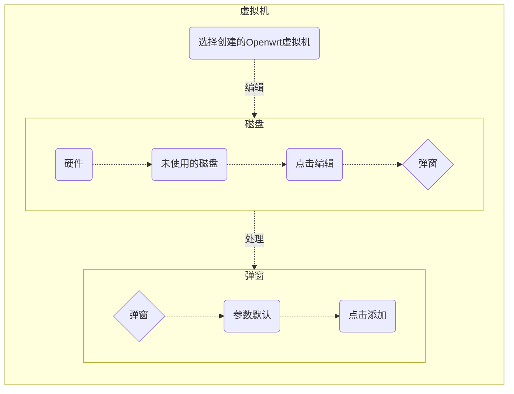
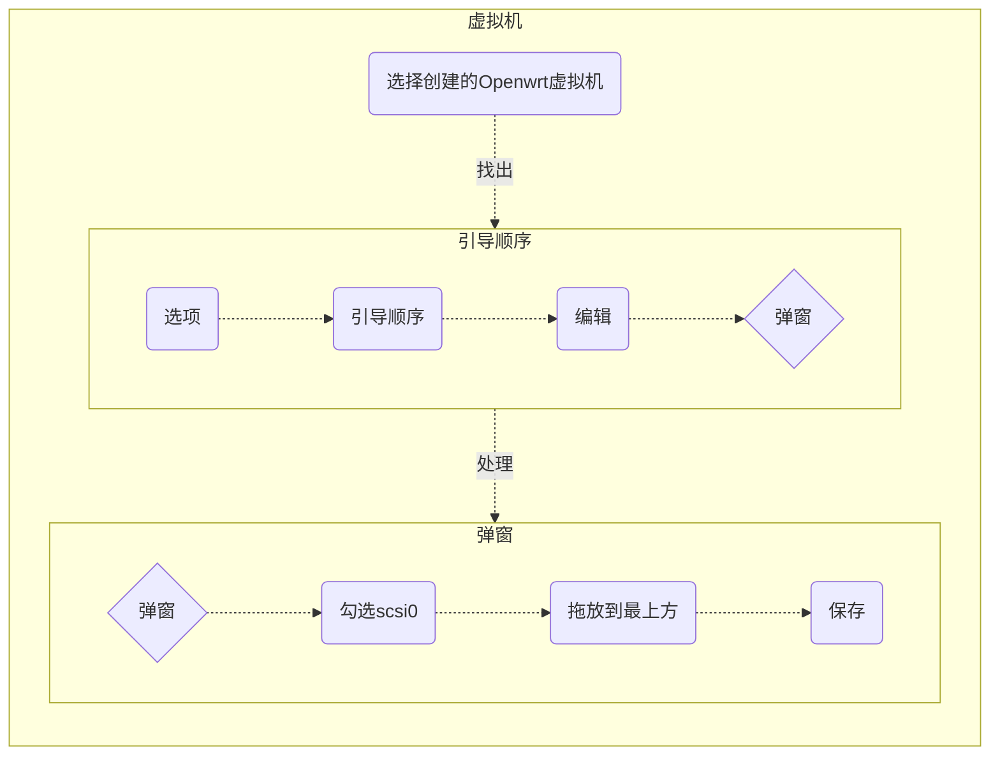
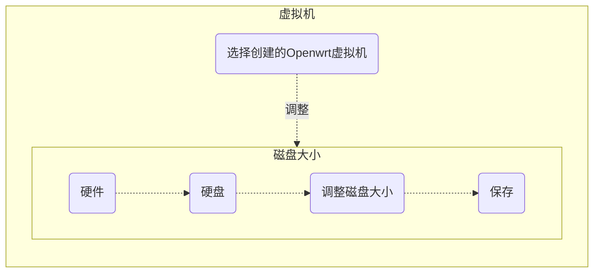
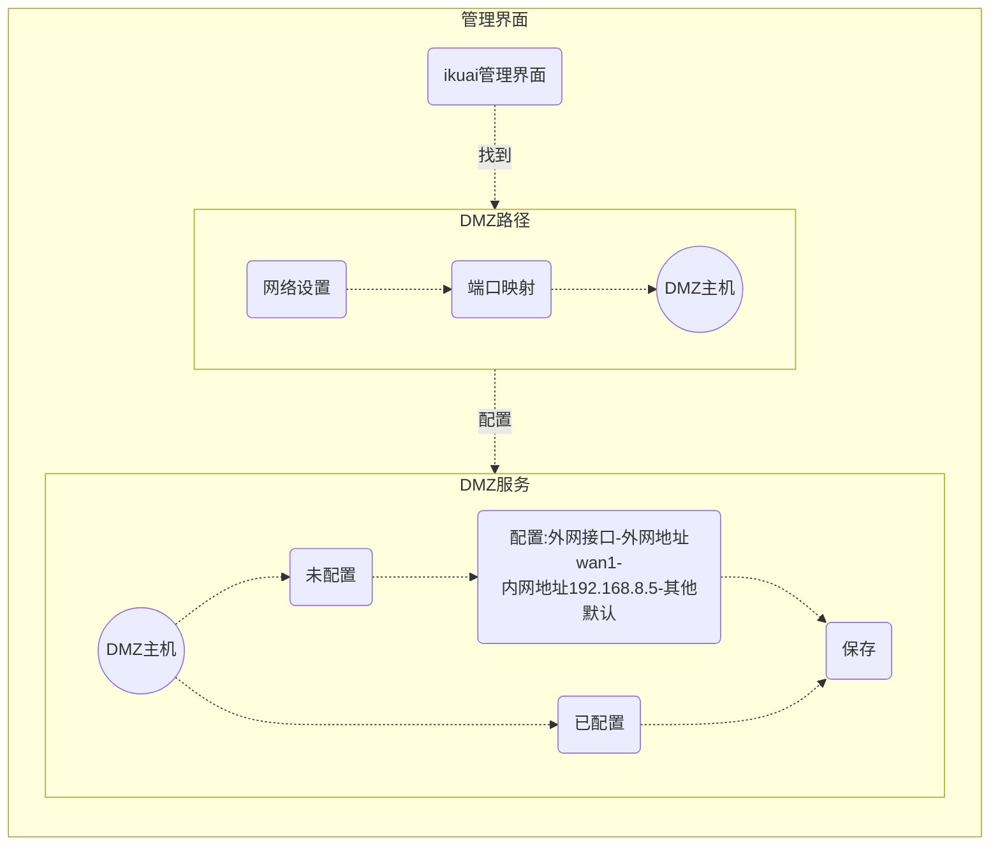

[参考文档](https://zhuanlan.zhihu.com/p/401495150)
方案一：dnsmasq容器
[TOC]


# 第一节 ikuai安装  
## 一、ISO镜像  
### 1、下载ISO镜像  
推荐下载32位，64位要求配置太高；但是64位有虚拟机安装功能。  

下载页传送机：[固件下载-爱快 iKuai](https://www.ikuai8.com/component/download)  

### 2、上传ISO镜像  
ISO文件上传到PVE磁盘的ISO镜像中  
例如：pve -> local -> ISO镜像

## 二、创建PVE虚拟机  
步骤分解：
### 1、创建虚拟机  
1)、点击右上角 创建虚拟机，跳出创建虚拟机选项卡  
### 2、虚拟机选项卡设置  
1)、常规设置：  
名称命名为iKuai  

2)、操作系统设置：  
点选使用CD/DVD光盘镜像文件，选择我们刚刚上传的爱快安装镜像  

3)、系统设置： 
显卡：VMWare兼容  
其他默认   

4)、磁盘设置：  
简单理解总线/设备  
|类型|用处|
|-|-|
|IDE|光驱等|
|SATA|机械硬盘等|
|SCSI|固态硬盘等|
这里默认SCSI就可以了  

存储：选中自己的硬盘  
磁盘大小(GIB):4G以上  

5)、CPU设置  
核心：最低1核  
VCPUs：1线  
类别：host  

6)、内存  
512M以上  

7)、网络  
- 模型：VirtIO（半虚拟化）  
- 防火墙：取消勾选
- 桥接：选PVE规划的wan口  

确认后，点击完成  


### 3、进一步完善虚拟机
1)、硬件设置  
添加网络设备  
第一步：点击左侧的iKuai虚拟机-硬件-添加-添加网络设备  
第二步：把规划好的WAN口和LAN口都添加上去   
注意：取消网络设备中的防火墙勾选   

2)、选项设置  
默认
如需调整：点击左侧的iKuai虚拟机-选项-引导顺序   

3)、防火墙设置  
取消一下两项，选否
点击左侧的iKuai虚拟机-防火墙-选项-防火墙  
点击左侧的iKuai虚拟机-防火墙-选项-DHCP  

> <font size ="2">4)、*非必要*</font>
> <font size ="2">添加in与out规则</font>
> <font size ="2">点击左侧的iKuai虚拟机-防火墙-添加</font>

## 三、ikuai初步配置  
初步设置，以便进去ikuai管理界面

- 启动虚拟机
- 然后切换到ikuai控制台
- 等待安装完成进入iKuai控制台界面了

1、网卡绑定  
在主界面选1，进入绑定网卡界面  
把规划的WAN和LAN网卡绑定上网卡  

```shell
#清除网卡
del lan1

#绑定wan1网卡
set wan1 ehh0

#绑定lan1网卡
set lan1 eth1
```
绑定以后，按"q"退出   

2、设置LAN/WAN地址  

在主界面选中2，进入设置地址界面
界面有说明怎么设置，按照示例设置好

```shell
#lan1口
192.168.8.1/255.255.255.0

#绑定wan1网卡
192.168.1.5/255.255.255.0
```

3、其他选项  

按"o"键，进入其他设置  

选2开启外网访问web，此时可以通过wan口获取的IP进去i快路由器  

由于ikuai使用的NAT模式，注意路由模式可能无法正常上网，所以访问内部需要设置端口映射  


# 第二节 openwrt安装
## 一、IMG镜像 

1、官方镜像源：  
- [硬件列表：固件下载](https://openwrt.org/zh/toh/views/toh_fwdownload?dataflt%5BBrand*%7E%5D=) 
- [openwrt-21.02.3-x86-64](https://downloads.openwrt.org/releases/21.02.3/targets/x86/64/) 
`推荐选generic-squashfs-rootfs.img.gz`  

2、第三方镜像
- [恩山论坛](https://www.right.com.cn/forum/forum.php)
- [阿里云](https://mirrors.aliyun.com/openwrt/releases/)
- [KoolCenter 固件下载服务器](https://fw.koolcenter.com/LEDE_X64_fw867/)
- [bleach github](https://github.com/bleach1991/lede)

## 二、创建PVE虚拟机  
步骤分解：
### 1、创建虚拟机  
1)、点击右上角 创建虚拟机，跳出创建虚拟机选项卡  

### 2、虚拟机选项卡设置  
1)、常规设置：  
名称命名为Openwrt 

2)、操作系统设置：  
- 镜像选择： 
  &emsp; 不使用任何介质  

- 客户机操作系统： 
  &emsp; 类别- Linux；  
  &emsp; 版本- 5.x-2.6kemel  

3)、系统设置： 
显卡：VMWare兼容  
其他默认   

4)、磁盘设置：  
硬盘无所谓，之后会删除，
然后对下载的img镜像创建虚拟磁盘挂载

5)、CPU设置  
核心：最低1核  
VCPUs：1线  
类别：host  

6)、内存  
256M以上  

7)、网络  
- 模型：VirtIO（半虚拟化） 
- 防火墙：取消勾选
- 桥接：选PVE规划的wan口  

确认后，点击完成  

8)、删除磁盘   

9)、上传镜像  
使用ftp工具，或者pve中上传img镜像到磁盘iso镜像中

10)、QM命令把镜像导入磁盘  
```shell
qm importdisk 100 /openwrt.img local
 -      -      -       -         -
 |      |      |       |         |
 |      |      |       |         +----- 保存的磁盘名
 |      |      |       +--------------- IMG镜像路径 
 |      |      +----------------------- 虚拟机ID
 |      +------------------------------ 导入磁盘
 +------------------------------------- qm命令
```
这一步也可以使用img2kvm工具实现，忽略下载上传，直接添加操作命令
```shell
# 增加执行权限
chmod +x img2kvm

# 此处和qm命令含义一样
./img2kvm openwrt[固件名].img 100 local
```

11)、添加磁盘    




12)、调整引导顺序  



## 三、OPenwrt初步设置  
### 1、调整磁盘大小 

*`磁盘大小建议5G以上`*  

### 2、配置IP 
启动OP软路由，修改lan口IP为设置的IP。

```shell
# 修改一下openwrt的IP地址  
vi /etc/config/network 

# 如192.168.8.5，后面会作为旁路由网关使用
```


### 3、配置远程连接Openwrt
第一种：DMZ主机连接
&emsp;在ikuaiDMZ主机映射openwrt（192.168.8.5）。此时，通过ikuai的wan口获取的ip访问时，连接的就是openwrt的管理界面。



第二种：端口转发
&emsp;设置在ikuai上端口转发，映射到openwrt的web管理页面界面，通过ikuai的wan口获取的ip+映射端口，就可以访问到openwrt的管理界面。  

## 四、磁盘分区扩容  
### 1、SSH客户端操作
可以在VNC里操作，也可以在SSH客户端操作。  

1)、安装需要的工具
```shell
opkg update

# 通常已经安装
opkg install fdisk cfdisk e2fsprogs kmod-fs-ext4

# fdisk         查看/分区磁盘工具
# cfdisk        傻瓜式分区工具
# e2fsprogs     格式化工具，包含了 mkfs 命令
# kmod-fs-ext4  ext4文件系统支持
```
*如果有提示“...installed in root is up to date”，说明系统中已经安装了这个工具*

2)、查看当前分区情况  
```shell
fdisk -l

# 结果
Disk /dev/sda: 5.39 GiB, 5788663808 bytes, 11305984 sectors
Disk model: QEMU HARDDISK   
Units: sectors of 1 * 512 = 512 bytes
Sector size (logical/physical): 512 bytes / 512 bytes
I/O size (minimum/optimal): 512 bytes / 512 bytes
Disklabel type: dos
Disk identifier: 0x6b7e68ef

Device     Boot  Start      End  Sectors  Size Id Type
/dev/sda1  *       512    33279    32768   16M 83 Linux
/dev/sda2        33792   820223   786432  384M 83 Linux
/dev/sda3       821248 11305983 10484736    5G 83 Linux
```
3)、硬盘进行分区规划  
&emsp;如果安装时还没扩展硬盘分区，先在虚拟机硬件选项中扩展磁盘分区大小。

扩展硬盘规划：
|序号|类型|大小|说明|推荐与否|
|-|-|-|-|-|
|1|swap交换分区|内存大小2倍|最大8G，挂载到swap分区|⭐⭐⭐⭐⭐|
|2|Docker分区|2G以上|使用的越多，分配越多越好||
|3|系统-软件包|1G以上|即根目录，挂载后，docker会自动挂载|⭐⭐⭐⭐⭐|
|4|overlay分区|1G以上|挂载后，docker会自动挂载||
|5|网络存储|越大越好|网络共享、Transmission、Ftp服务等，其他地方有实现，可以不要|⭐|
|6|/dev/sda2|300M以上|占用100%，扩容下就可以了|⭐⭐|

&emsp;&emsp;overlayfs的主要作用有两个。一是压缩存储文件，在磁盘空间紧张的情况下尽量少占用空间；二是加了一层对系统底层的保护机制，在折腾不当的情况下可以“还原出厂设置”，避免变砖

```
******************推荐扩容方案******************
* 把/dev/sda2扩容到300M以上；
* 添加swap分区；
* 分配系统软件分区；
* 如果有网络存储的需要，其余空间全部留给网络存储。
```

*说明，MBR磁盘只能挂4个主分区，分区多是，最后一个建立扩展分区*

web界面查看磁盘类型路径：
openwrt -> 系统 -> 磁盘管理 -> 磁盘-> 分区表

4)、使用cfdisk分区操作   
cfdisk命令含义：  
↑↓上下键切换分区，
new创建，
resize改变大下，
write生效，
quit退出
```shell
# 对磁盘sda执行分区
cfdisk /dev/sda

# 切换sda2,扩容该分区
# 选 resize 填入500M回车
# 切换free space分区，创建swap分区sda3
# 切换free space分区，创建扩展分区sda4
# 切换sda4分区，创建逻辑分区sda5作为根分区
# 切换sda4分区，创建逻辑分区sda6作为共享分区

# 分区完成后，点击write后再点击quit退出
```

5)、格式化新建分区
注意Swap交换分区和普通分区的区别
```shell
# 查看分区，确定要格式的盘
lsblk

# 交换分区格式化3
mkswap /dev/sda3

# 文件系统分区格式化刚创建的分区4、5、6
mkfs.ext4 /dev/sda{4,5,6} -y

------------------------------------------------------------------------------------------
格式化出错提示:/dev/sda3 is mounted;will not make a filesystem here!)分区可用，不需要格式化了

# 看到这个提示，不需要担心，这个是已经格式化的分区，跳过这个分区，继续下一个分区格式化即可
```

### 2、Openwrt主界面操作

1)、挂载swap交换分区  
- 挂载：

- 查看：


2)、挂载swap交换分区  


## 5、安装QEMU Guest Agent
1、GUI安装  
进入系统-软件包-动作  
在过滤器搜索qemu-ga安装  

2、命令安装  
```shell
opkg install qemu-ga

reboot
```
安装后重启系统生效  

# 第三节 ikuai进一步配置

## 一、NAT模式下被一级路由访问


# 第四节 设置op为ikuai的路由
## 一、ikuai网关与DNS配置

## 二、op配置
### 1、接口配置

### 3、防火墙与端口转发


# 第五节 给OP设置DNS服务器

### 1、修改op的lan口自定义DNS

### 2、SmartDNS 服务器

### 3、AdGuard Home

### 4、OpenClash


